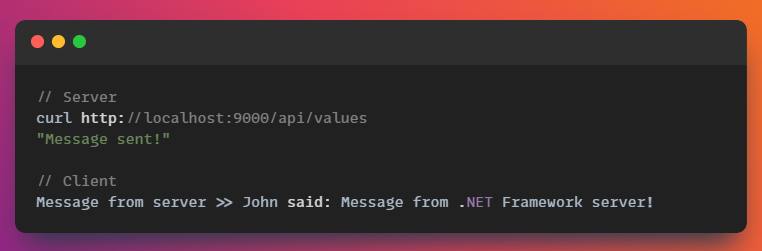

# AspNET SignalR POC
Proof of concept of a .NET Framework server that sends messages to clients through SignalR.  
The goal of this project was to understand the feasibility/blockers/unknowns around the following topics:
- Hosting a bare bones Http Server on a .NET Framework library project
- Expose a WebAPI with public endpoints
- Send real-time data as WebSocket messages with SignalR
  - Available serialization formats (preference for binary)

The outcome would help me on deciding if this setup would be a good fit for a Unity game project and for my requirements.

## Running the project

1. Clone the repository
2. Startup both projects (server first, client after)
3. Make a GET request to the server `curl http://localhost:9000/api/values`

## Results

| Area                        | Comments                                                                                                                                                                                                                                                                                                                                                                                                                         |
|-----------------------------|----------------------------------------------------------------------------------------------------------------------------------------------------------------------------------------------------------------------------------------------------------------------------------------------------------------------------------------------------------------------------------------------------------------------------------|
| Self hosted Http Server     | :white_check_mark:                                                                                                                                                                                                                                                                                                                                                                                                               |
| Expose public endpoints     | :white_check_mark:                                                                                                                                                                                                                                                                                                                                                                                                               |
| SignalR dependencies        | - Server and Client must use specific SignalR packages ([SignalR package differences](https://learn.microsoft.com/en-us/aspnet/core/signalr/version-differences?view=aspnetcore-8.0))   - If the Server is .NET Framework, it must use `Microsoft.AspNet.SignalR`   - .NET Core clients that wish to connect to the server must use `Microsoft.AspNet.SignalR.Client` (instead of `Microsoft.AspNetCore.SignalR.Client`)   |
| Server dependency footprint | Large. Multiple .dlls must be imported into Unity to support a self hosted API and SignalR.                                                                                                                                                                                                                                                                                                                                      |
| SignalR serialization       | ASP.NET SignalR implementation for .NET Framework supports Json out of the box but doesn't provide support for binary formats such as `protobuf` or `MessagePack`                                                                                                                                                                                                                                                                ||                                                                                                                                                                                                                                             |

## Outcome

Self hosting a WebAPI and sending WebSocket messages with SignalR required little to no effort.  
ASP.NET SignalR limits the serialization format choices that can be used. It might be possible to overcome this limitation at the cost of more effort/custom logic, but without any guarantees that it will work.  
Integration with Unity will result in several `Microsoft.*` .dlls that need to be imported - more susceptible to version conflicts and errors.

I decided to abandon this approach and use a [WebSocket library](https://github.com/sta/websocket-sharp) that allows me to serialize messages with protobuf while also exposing public endpoints.  
All in the same package and fewer .dlls